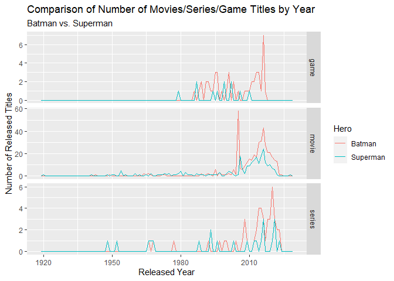

ST558 Porject 1
================
Chien-Lan Hsueh
2022-06-26

## Introduction

[The Open Movie Database (OMDb)](https://www.omdbapi.com/) is a public
online database and provides API to use the web service for movie
information.

In this project, I will go through my setup including a script to render
the rmarkdown, and the tools and libraries I use in this project. Then I
will develop a set of helper functions including a wrapper function to
make the API calls easy with returned data in a data frame format. After
checking all the functions work as expected, I will then use it to
obtain some movie information from OMDb web service and perform some
basic EDA including numerical and graphical summaries on the data.

Meanwhile, a [blog](https://chsueh2.github.io/ST558-1st-project.html) is
posted on my GitHub pages to share my experience and thinking when doing
this project.

## Setup 0: Codes to Render this Markdown Page

This code chunk (don’t execute) shows how to use `RMarkdown::render()`
to render this rmarkdown document.

``` r
library(rmarkdown)
library(knitr)

rmarkdown::render(
  input = input, 
  output_format = github_document(html_preview = FALSE), 
  output_file = "README.md"
  output_dir = output_dir
)
```

## Setup 1: Confidential Keys

It’s a good practice not to include any login confidential information
like passwords or access keys explicitly in codes. Here, we use
`keyring` to store the API key.

At the first time to run this notebook, uncomment the following line and
execute it. RStudio will ask for your API key and store it. This needs
to be done only once.

``` r
# Uncomment the following line to save the API key
#rstudioapi::askForSecret("OMDb")
```

## Setup 2: (Install and) Load Packages

We will use the following packages in this project:

-   `here`: enables easy file referencing and builds file paths in a
    OS-independent way
-   `keyring`: provides OS-independent ‘API’ to access system’s
    credential store
-   `stats`: loads this before loading `tidyverse` to avoid masking some
    `tidyverse` functions
-   `tidyverse`: includes collections of useful packages like `dplyr`
    (data manipulation), `tidyr` (tidying data), `ggplots` (creating
    graphs), etc.
-   `rlang`: deals with missing arguments in our helper functions
-   `lubridate`: handle date and datetime data type
-   `glue`: offers interpreted string literals for easy creation of
    dynamic messages and labels
-   `scales`: formats and labels scales nicely for better visualization
-   `httr`: performs HTTP web APIs
-   `jsonliet`: parses data stored in JSON format
-   `GGally`: plots a very nice scatterplot matrix

In addition, the `pacman` package provides handy tools to manage R
packages (install, update, load and unload). We use its `p_laod()`
instead of `libarary()` to load the packages listed above.

``` r
# load the `pacman` package
# if it's not yet installed, install and load it
if (!require("pacman")) utils::install.packages("pacman", dependencies = TRUE)

# load the required packages whether it's installed or not
pacman::p_load(
    here, keyring,
    stats, 
    tidyverse, rlang,
    lubridate,
    glue, scales,
    httr, jsonlite,
    GGally
)
```

## Helper Functions

The first helper function is a negated version of the built-in `%in%`
operator. This makes our codes cleaner and easier to read when we check
if an element is absent.

``` r
# not %in%
'%notin%' <- Negate('%in%')
```

To make the OMDb API easy to use, we define some helper functions and
wrap them up in a user-friendly function to perform a query. There are
mainly two different API queries: (1) inquiry by a IMDb ID or a movie
title, and (2) inquiry with a movie title search. To perform the
queries, we define the following helper functions and an easy-to-use
wrapper to do API calls.

-   `OMDb_setup_query()`: sets up the query parameters
-   `OMDB_query()`: performs an API call and check the results (status)
-   `OMDb_parse_movie()`: parse inquiry results of a movie by its IMDb
    ID or title (with/without other optional parameters)
-   `OMDb_parse_search()` parse search results (with/without using other
    optional parameters)
-   `OMDb_movie()`: a wrapper function to do a movie query or search
    (with or without other optional parameters)

Note: The variable `Year` returned in the query response is character
but might not be a single year. In some cases (especially for media
type: series), it can be a character string like `2015-2020` or `2015-`.
Therefore, `Year` variable will be kept as is. Instead, a new date
variable `Year_satrt` will be created to get the beginning year of the
span.

### `OMDb_setup_query()`

Create query parameters in a list of key-value pairs:

> Arguments:
>
> -   `args`: a list of all other arguments passed in from the wrapper
>     function `OMDb_movie()`
> -   `by`: method of API query. Needs to be one of the API supported
>     methods
> -   `value`: value to inquery or search for
> -   `page`: (optional) specified page of search results
> -   `verbose`: a boolean switch to print out the query
>
> Returned Value: query parameters in a list of key-value pairs

``` r
# a helper function to create query parameters in a list of key-value pairs
OMDb_setup_query <- function(args, by = c("id", "title", "search"), value, page, verbose = T, ...) {
  # verify query method argument `by` to be one of the supported methods
  by <- match.arg(by)
  
  # assign default query value if it's missing in argument (for demo and test purpose)
  if(is_missing(value)){
    value <- c("tt1285016", "Batman", "Batman")[by == c("id", "title", "search")]
  }

  # assign default page value (only needed when using search method)
  if(by == "search") {
    args$page <- ifelse(is_missing(page), "1", as.character(page))
  }
  
  # remove `by` and `value` from the list
  # also remove argument `r` (if exists) because this function only supports JSON
  args[c("by", "value", "r")] <- NULL

  # construct the query as a list of query parameters and the api key
  query0 <- 
    # key-value pair from the query method `by` and query value `value`
    switch(by,
      id = list(i = value),
      title = list(t = value),
      search = list(s = value)) %>% 
    # append the rest of query parameters
    append(args)

  # print out the query
  if(verbose){
    print(glue(
      "Query: {paste(names(query0), query0, sep = '=', collapse = ',')}"
    ))
  }

  # add the api key
  query <- query0 %>% 
    # add the api key
    append(list(apiKey = key_get("RStudio Keyring Secrets", "OMDb")))
  
  return(query)
}
```

### `OMDB_query()`

A wrapper of `httr::Get()` to send a query request, convert and parse
the response data, and check the execution status.

> Arguments:
>
> -   `query`: query parameters in a list of key-value pairs
>
> Returned Value: parsed JSON content data from the API response

``` r
# a low-level helper function to send a query request and check the execution status
OMDB_query <- function(query){
  # send API query request
  rawdata <- GET(url = "http://www.omdbapi.com/", query = query)

  # check if the request is successful
  # if not, stop and print the HTTP status code
  if(!between(rawdata$status_code, 200, 299)) {
    stop(glue(
      "The HTTP GET request is not successful. HTTP status code: {rawdata$status_code}"
    ))
  }
  
  # parse the JSON content data
  parsed <- fromJSON(rawToChar(rawdata$content))
  
  # remove any empty list
  for(i in names(parsed)){
    if(length(parsed[[i]]) == 0) parsed[[i]] <- NA
  }
  
  # failed response
  if(parsed$Response == "False"){
    stop(glue(
      "The HTTR Get request is successful but the respose of the query has a false return ",
      "with an error message from API server: {parsed$Error}"
    ))
  }
  
  return(parsed)
}
```

### `OMDb_parse_movie()`

Parse info of a movie and save in a data frame after data type
conversion for numeric data (`Runtim` in minutes, `imdbRating`,
`BoxOffice` in dollar amount, etc) and date time data (`Released` date).

> Arguments:
>
> -   `parsed`: a parsed JSON content data from a query of a movie
>
> Returned Value: a data frame with the information of the movie

``` r
# a helper function to parse info of a movie and save in a data frame
OMDb_parse_movie <- function(parsed){
  # convert the data into appropriate data type and save in a data frame
  df <- parsed %>% 
    as_tibble() %>% 
    # convert columns to numeric type
    mutate(across(matches(
      c("Runtime", "Metascore", "imdbRating", "imdbVotes", "BoxOffice", "totalSeasons")),
      ~parse_number(.x, na = c("", "NA", "N/A")))) %>% 
    # convert columns to datetime type
    mutate(across(matches(
      c("Released", "DVD")), 
      ~parse_date(.x, na = c("", "NA", "N/A"), format = "%d %b %Y"))) %>% 
    mutate(Year_start = parse_number(Year))
  
  return(df)
}
```

### `OMDb_parse_search()`

Parse search results and save in a data frame. If only asks for a
specified page of the search results, return that page, otherwise,
retrieve the remaining pages and return all results.

> Arguments:
>
> -   `parsed`: a parsed JSON content data from a query of a movie
> -   `query`: query parameters in a list of key-value pairs
> -   `args`: a list of all other arguments passed in from the wrapper
>     function `OMDb_movie()`
>
> Returned Value: a data frame with the search results

``` r
# a helper function to parse search results and save in a data frame
OMDb_parse_search <- function(parsed, query, args){
  df <- parsed$Search %>% as_tibble()
  
  # how many pages of the search results    
  totalPages <- ceiling(as.numeric(parsed$totalResults)/10)
  
  # if there are more than one page and page argument is not specified
  # get the remaining pages
  if (("page" %notin% names(args)) && totalPages > 1){
    for (i in 2:totalPages) {
      query$page <- as.character(i)
      df_nextpage <- OMDB_query(query)$Search %>% as_tibble()
      df <- bind_rows(df, df_nextpage)
    }
  }
  
  # add the total results and sort the data by Type and Year  
  df <- df %>% 
    mutate(
      Year_start = parse_number(Year),
      totalResults = parsed$totalResults
    ) %>% 
    arrange(Title, Type, Year)
}
```

### `OMDb_movie()`

A wrapper function to do a movie query or search (with or without other
optional parameters).

> Arguments:
>
> -   `by`: method of API query. Needs to be one of the API supported
>     methods
> -   `...`: (optional) query parameters including `type`, `y` (year),
>     `page` (page number of search return), `plot`, etc. More info of
>     the API parameters can be found
>     [here](https://www.omdbapi.com/#parameters).
>
> Returned Value: a data frame of what the query returns

``` r
# a user-friendly wrapper function to perform an API query
OMDb_movie <- function(by = c("id", "title", "search"), ...) {
  # save all arguments as a named list
  args <- as.list(match.call())[-1]
  
  # set up query string
  query <- OMDb_setup_query(args, by, ...)
  parsed <- OMDB_query(query)
  
  # convert parsed data into a data frame based on query method
  if (by == "search"){
    # search returns a list of movies
    df <- OMDb_parse_search(parsed, query, args)
  } else {
    # when using search by id and title,  returns info of the movie
    df <- OMDb_parse_movie(parsed)
  }
  
  return(df)
}
```

## Test and Examples of Using `OMDb_movie()`

In this section, we will test the wrapper function and demonstrate its
usages.

### Single-movie queries (by IMDb ID)

When doing a single-movie query with an IMDb ID (using OMDb API’s `i`
parameter), the API only returns an exact match if there exists, or an
false response with an error message if not exact match. The successful
returned data can be a movie, a TV series or a game title. Different
media types have different variables (data columns) in the returns and
the wrapper function should be able to take care of these differences in
the background.

``` r
# Superman
super1 <- OMDb_movie(by = "id", value = "tt0078346") # movie
```

    ## Query: i=tt0078346

``` r
super1
```

    ## # A tibble: 3 × 26
    ##   Title    Year  Rated Released   Runtime Genre  Director Writer Actors Plot  Language Country Awards Poster
    ##   <chr>    <chr> <chr> <date>       <dbl> <chr>  <chr>    <chr>  <chr>  <chr> <chr>    <chr>   <chr>  <chr> 
    ## 1 Superman 1978  PG    1978-12-15     143 Actio… Richard… Jerry… Chris… An a… English  United… Nomin… https…
    ## 2 Superman 1978  PG    1978-12-15     143 Actio… Richard… Jerry… Chris… An a… English  United… Nomin… https…
    ## 3 Superman 1978  PG    1978-12-15     143 Actio… Richard… Jerry… Chris… An a… English  United… Nomin… https…
    ## # … with 12 more variables: Ratings <df[,2]>, Metascore <dbl>, imdbRating <dbl>, imdbVotes <dbl>,
    ## #   imdbID <chr>, Type <chr>, DVD <date>, BoxOffice <dbl>, Production <chr>, Website <chr>, Response <chr>,
    ## #   Year_start <dbl>

``` r
super2 <- OMDb_movie(by = "id", value = "tt0106057") # series
```

    ## Query: i=tt0106057

``` r
super2
```

    ## # A tibble: 1 × 23
    ##   Title     Year  Rated Released   Runtime Genre Director Writer Actors Plot  Language Country Awards Poster
    ##   <chr>     <chr> <chr> <date>       <dbl> <chr> <chr>    <chr>  <chr>  <chr> <chr>    <chr>   <chr>  <chr> 
    ## 1 Lois & C… 1993… TV-PG 1993-09-12      46 Adve… N/A      Debor… Dean … In a… English  United… Nomin… https…
    ## # … with 9 more variables: Ratings <df[,2]>, Metascore <dbl>, imdbRating <dbl>, imdbVotes <dbl>,
    ## #   imdbID <chr>, Type <chr>, totalSeasons <dbl>, Response <chr>, Year_start <dbl>

``` r
super3 <- OMDb_movie(by = "id", value = "tt0772202") # game
```

    ## Query: i=tt0772202

``` r
super3
```

    ## # A tibble: 1 × 26
    ##   Title     Year  Rated Released   Runtime Genre Director Writer Actors Plot  Language Country Awards Poster
    ##   <chr>     <chr> <chr> <date>       <dbl> <chr> <chr>    <chr>  <chr>  <chr> <chr>    <chr>   <chr>  <chr> 
    ## 1 Superman… 2006  T     2006-11-14      NA Acti… N/A      Flint… Brand… The … English  USA     N/A    https…
    ## # … with 12 more variables: Ratings <df[,2]>, Metascore <dbl>, imdbRating <dbl>, imdbVotes <dbl>,
    ## #   imdbID <chr>, Type <chr>, DVD <date>, BoxOffice <dbl>, Production <chr>, Website <chr>, Response <chr>,
    ## #   Year_start <dbl>

Note: If a query returns a movie, the variable `ratings` is a dateframe
with two columns: `Ratings$Source` and `RatingsValue`. In a tibble, this
is a list column (a column that stores a dataframe in it). The dataframe
printout might look differently depending on the rendering options.

### Single-movie queries (by Title)

When doing a query by a title (using OMDb API’s `t` parameter), the API
call again returns one result but its behavior is different from queries
by IMDb ID in the following ways:

-   If there is no exact match, it returns one movie with partially
    matched title (not clearly how it decides which to pick).
-   If there is only one exact match, it turns that movie.
-   If there are more than one exact match, it still returns one movie
    (again, not clearly how it decides which to pick). We can specify an
    additional search parameter like `y` (year) to get other matched
    movies.

``` r
# Batman
batman1 <- OMDb_movie(by = "title", value = "Batman") # title
```

    ## Query: t=Batman

``` r
batman1
```

    ## # A tibble: 3 × 26
    ##   Title  Year  Rated Released   Runtime Genre    Director Writer Actors Plot  Language Country Awards Poster
    ##   <chr>  <chr> <chr> <date>       <dbl> <chr>    <chr>    <chr>  <chr>  <chr> <chr>    <chr>   <chr>  <chr> 
    ## 1 Batman 1989  PG-13 1989-06-23     126 Action,… Tim Bur… Bob K… Micha… The … English… United… Won 1… https…
    ## 2 Batman 1989  PG-13 1989-06-23     126 Action,… Tim Bur… Bob K… Micha… The … English… United… Won 1… https…
    ## 3 Batman 1989  PG-13 1989-06-23     126 Action,… Tim Bur… Bob K… Micha… The … English… United… Won 1… https…
    ## # … with 12 more variables: Ratings <df[,2]>, Metascore <dbl>, imdbRating <dbl>, imdbVotes <dbl>,
    ## #   imdbID <chr>, Type <chr>, DVD <date>, BoxOffice <dbl>, Production <chr>, Website <chr>, Response <chr>,
    ## #   Year_start <dbl>

``` r
batman2 <- OMDb_movie(by = "title", value = "Batman", y = 1966) # year
```

    ## Query: t=Batman,y=1966

``` r
batman2
```

    ## # A tibble: 3 × 26
    ##   Title  Year  Rated Released   Runtime Genre    Director Writer Actors Plot  Language Country Awards Poster
    ##   <chr>  <chr> <chr> <date>       <dbl> <chr>    <chr>    <chr>  <chr>  <chr> <chr>    <chr>   <chr>  <chr> 
    ## 1 Batman 1966  PG    1966-07-30     105 Action,… Leslie … Loren… Adam … The … English… United… 1 win  https…
    ## 2 Batman 1966  PG    1966-07-30     105 Action,… Leslie … Loren… Adam … The … English… United… 1 win  https…
    ## 3 Batman 1966  PG    1966-07-30     105 Action,… Leslie … Loren… Adam … The … English… United… 1 win  https…
    ## # … with 12 more variables: Ratings <df[,2]>, Metascore <dbl>, imdbRating <dbl>, imdbVotes <dbl>,
    ## #   imdbID <chr>, Type <chr>, DVD <date>, BoxOffice <dbl>, Production <chr>, Website <chr>, Response <chr>,
    ## #   Year_start <dbl>

We can also specify the parameter `plot` to get different versions of
the plot:

``` r
batman3 <- OMDb_movie(by = "title", value = "Batman", y = 1966, type = "series") # series
```

    ## Query: t=Batman,y=1966,type=series

``` r
batman3
```

    ## # A tibble: 1 × 23
    ##   Title  Year     Rated Released   Runtime Genre Director Writer Actors Plot  Language Country Awards Poster
    ##   <chr>  <chr>    <chr> <date>       <dbl> <chr> <chr>    <chr>  <chr>  <chr> <chr>    <chr>   <chr>  <chr> 
    ## 1 Batman 1966–19… TV-G  1966-01-12      25 Acti… N/A      Loren… Adam … The … English  United… Nomin… https…
    ## # … with 9 more variables: Ratings <df[,2]>, Metascore <dbl>, imdbRating <dbl>, imdbVotes <dbl>,
    ## #   imdbID <chr>, Type <chr>, totalSeasons <dbl>, Response <chr>, Year_start <dbl>

``` r
batman4 <- OMDb_movie(by = "title", value = "Batman", y = 1966, type = "series", plot = "full") # series
```

    ## Query: t=Batman,y=1966,type=series,plot=full

``` r
batman4
```

    ## # A tibble: 1 × 23
    ##   Title  Year     Rated Released   Runtime Genre Director Writer Actors Plot  Language Country Awards Poster
    ##   <chr>  <chr>    <chr> <date>       <dbl> <chr> <chr>    <chr>  <chr>  <chr> <chr>    <chr>   <chr>  <chr> 
    ## 1 Batman 1966–19… TV-G  1966-01-12      25 Acti… N/A      Loren… Adam … Weal… English  United… Nomin… https…
    ## # … with 9 more variables: Ratings <df[,2]>, Metascore <dbl>, imdbRating <dbl>, imdbVotes <dbl>,
    ## #   imdbID <chr>, Type <chr>, totalSeasons <dbl>, Response <chr>, Year_start <dbl>

``` r
print(glue(
  "Short plot: \n\t{batman3$Plot}\n\n",
  "Full plot: \n\t{batman4$Plot}"
))
```

    ## Short plot: 
    ##  The Caped Crusader and his young ward battle evildoers in Gotham City.
    ## 
    ## Full plot: 
    ##  Wealthy entrepreneur Bruce Wayne (Adam West) and his ward Dick Grayson (Burt Ward) lead a double life: they are actually the crime-fighting duo Batman and Robin. A secret Batpole in the Wayne mansion leads to the Batcave, where Police Commissioner Gordon (Neil Hamilton) summons the Dynamic Duo on the Batphone with the latest emergency threatening Gotham City. Racing to the scene of the crime in the jet-powered Batmobile, Batman and Robin must (with the help of their trusty utility-belts) thwart the efforts of a rogues gallery of flamboyant archvillains, including The Joker (Cesar Romero), The Penguin (Burgess Meredith), The Riddler (Frank Gorshin) and the Catwoman (Julie Newmar and Eartha Kitt).

### Search with a Partially Matched Value

Searches using OMDb API’s `s` parameter return a list of media
(movies/series/games) as long as they have exact or partial match to the
search value. Without specifying `page` parameter, our helper function
will make multiple API calls to retrieve all of the results page by page
and return all results in a data frame.

``` r
batman_list <- OMDb_movie(by = "search", value = "Batman")
```

    ## Query: s=Batman,page=1

``` r
batman_list
```

    ## # A tibble: 508 × 7
    ##    Title                                                  Year  imdbID  Type  Poster Year_start totalResults
    ##    <chr>                                                  <chr> <chr>   <chr> <chr>       <dbl> <chr>       
    ##  1 [Bootleg] Batman: Vickie Valle                         2014  tt4365… movie https…       2014 508         
    ##  2 A Batman Voice Video                                   2012  tt1085… movie N/A          2012 508         
    ##  3 A First Look at Batman: Under the Red Hood             2010  tt1640… movie N/A          2010 508         
    ##  4 A First Look at Superman/Batman: Apocalypse            2010  tt1706… movie N/A          2010 508         
    ##  5 A Test of Minds: The Psychology of Superman and Batman 2009  tt1542… movie N/A          2009 508         
    ##  6 Adis Games: Batman Arkham/Return to Arkham             2016– tt6446… seri… N/A          2016 508         
    ##  7 Alyas Batman at Robin                                  1965  tt1228… movie https…       1965 508         
    ##  8 Alyas Batman en Robin                                  1991  tt0121… movie https…       1991 508         
    ##  9 An Interview with Batman                               2014  tt3521… movie https…       2014 508         
    ## 10 Ask Batman                                             2018  tt8594… movie https…       2018 508         
    ## # … with 498 more rows

If the `page` parameter is specified, then it will only return the
results on the page (10 results on a page):

``` r
batman_list_p1 <- OMDb_movie(by = "search", value = "Batman", page = 1)
```

    ## Query: s=Batman,page=1

``` r
batman_list_p1
```

    ## # A tibble: 10 × 7
    ##    Title                              Year      imdbID    Type   Poster              Year_start totalResults
    ##    <chr>                              <chr>     <chr>     <chr>  <chr>                    <dbl> <chr>       
    ##  1 Batman                             1989      tt0096895 movie  https://m.media-am…       1989 508         
    ##  2 Batman & Robin                     1997      tt0118688 movie  https://m.media-am…       1997 508         
    ##  3 Batman Begins                      2005      tt0372784 movie  https://m.media-am…       2005 508         
    ##  4 Batman Forever                     1995      tt0112462 movie  https://m.media-am…       1995 508         
    ##  5 Batman Returns                     1992      tt0103776 movie  https://m.media-am…       1992 508         
    ##  6 Batman v Superman: Dawn of Justice 2016      tt2975590 movie  https://m.media-am…       2016 508         
    ##  7 Batman: The Animated Series        1992–1995 tt0103359 series https://m.media-am…       1992 508         
    ##  8 Batman: Under the Red Hood         2010      tt1569923 movie  https://m.media-am…       2010 508         
    ##  9 The Batman                         2022      tt1877830 movie  https://m.media-am…       2022 508         
    ## 10 The Lego Batman Movie              2017      tt4116284 movie  https://m.media-am…       2017 508

``` r
batman_list_p2 <- OMDb_movie(by = "search", value = "Batman", page = 2)
```

    ## Query: s=Batman,page=2

``` r
batman_list_p2
```

    ## # A tibble: 10 × 7
    ##    Title                                               Year      imdbID Type  Poster Year_start totalResults
    ##    <chr>                                               <chr>     <chr>  <chr> <chr>       <dbl> <chr>       
    ##  1 Batman                                              1966      tt006… movie https…       1966 508         
    ##  2 Batman Beyond                                       1999–2001 tt014… seri… https…       1999 508         
    ##  3 Batman v Superman: Dawn of Justice Ultimate Edition 2016      tt186… movie https…       2016 508         
    ##  4 Batman: Assault on Arkham                           2014      tt313… movie https…       2014 508         
    ##  5 Batman: Gotham Knight                               2008      tt111… movie https…       2008 508         
    ##  6 Batman: Mask of the Phantasm                        1993      tt010… movie https…       1993 508         
    ##  7 Batman: The Dark Knight Returns, Part 1             2012      tt231… movie https…       2012 508         
    ##  8 Batman: The Dark Knight Returns, Part 2             2013      tt216… movie https…       2013 508         
    ##  9 Batman: The Killing Joke                            2016      tt485… movie https…       2016 508         
    ## 10 Batman: Year One                                    2011      tt167… movie https…       2011 508

### Tests with Bad Parameters

It’s always a good idea to test how our functions handle some bad inputs
(query parameters) by users. In this section, we briefly test the
following three cases.

#### Bad (Invalid) IMDBb ID

If we have an invalid IMDb ID, we get an error message from the respond.

Note: I have to turn the evaluation option off or the rendering function
won’t work.

``` r
bad_id <- OMDb_movie(by = "id", value = "in_valid_ID_tt0772203332")
bad_id

# the error message:
#Error in OMDB_query(query) : 
#The HTTR Get request is successful but the respose of the query has a false return with an error message from API server: Incorrect IMDb ID. 
```

#### Bad (Makeup) Title

It seems this API always tries it best and returns a “partially”
matching result even when you use a very weird title to search for:

``` r
bad_title <- OMDb_movie(by = "title", value = "@!#2@#")
```

    ## Query: t=@!#2@#

``` r
bad_title
```

    ## # A tibble: 3 × 26
    ##   Title     Year  Rated Released   Runtime Genre Director Writer Actors Plot  Language Country Awards Poster
    ##   <chr>     <chr> <chr> <date>       <dbl> <chr> <chr>    <chr>  <chr>  <chr> <chr>    <chr>   <chr>  <chr> 
    ## 1 Terminat… 1991  R     1991-07-03     137 Acti… James C… James… Arnol… A cy… English… United… Won 4… https…
    ## 2 Terminat… 1991  R     1991-07-03     137 Acti… James C… James… Arnol… A cy… English… United… Won 4… https…
    ## 3 Terminat… 1991  R     1991-07-03     137 Acti… James C… James… Arnol… A cy… English… United… Won 4… https…
    ## # … with 12 more variables: Ratings <df[,2]>, Metascore <dbl>, imdbRating <dbl>, imdbVotes <dbl>,
    ## #   imdbID <chr>, Type <chr>, DVD <date>, BoxOffice <dbl>, Production <chr>, Website <chr>, Response <chr>,
    ## #   Year_start <dbl>

#### Bad Search Value

Because there is no exact match and are too many partial matched
results, the API call return a failure response (although the HTTR
request is successful) with an error message (from API server) saying
that there are too many results.

Note: I have to turn the evaluation option off or the rendering function
won’t work.

``` r
bad_list <- OMDb_movie(by = "search", value = "@!#2@#")
bad_list

# the error message:
#Error in OMDB_query(query) : 
#The HTTR Get request is successful but the response of the query has a false return with an error message from API server: Too many results.
```

## EDA

Since we have already done a search to get a list of all Batman-related
title, let’s take a look at the data.

``` r
print(glue(
  "The Batman search returns {nrow(batman_list)} results ",
  "in {length(unique(batman_list$Type))} types of media ",
  "including {batman_list$Type %>% unique() %>% toString()} ",
  "from {min(batman_list$Year_start)} to {max(batman_list$Year_start)} ",
  "(planned to be released)."
))
```

    ## The Batman search returns 508 results in 3 types of media including movie, series, game from 1943 to 2024 (planned to be released).

``` r
# one-way table
table(batman_list$Type)
```

    ## 
    ##   game  movie series 
    ##     46    415     47

``` r
# bar plot of media types
batman_list %>% 
  ggplot(aes(x = Type, fill = Type)) +
  geom_bar() +
  labs(
    title = "Comparison of Number of Batman Movies/Series/Game Titles",
    subtitle = glue("From {min(batman_list$Year_start)} to {max(batman_list$Year_start)}"),
    x = "Media Type",
    y = "Count"
  )
```

<!-- -->

``` r
# histogram
batman_list %>% ggplot(aes(Year_start, fill = Type)) +
  geom_histogram(position = "dodge2", binwidth = 1) +
  labs(
    title = "Histogram of Batman Movies/Series/Game Titles by Year",
    subtitle = glue("From {min(batman_list$Year_start)} to {max(batman_list$Year_start)}"),
    x = "Released Year",
    y = "Number of Released Titles"
  )
```

<!-- -->

I think it will be interesting to look at the movies of DC’s another big
IP: Superman.

``` r
superman_list <- OMDb_movie(by = "search", value = "Superman")
```

    ## Query: s=Superman,page=1

``` r
superman_list
```

    ## # A tibble: 282 × 7
    ##    Title                                                  Year   imdbID Type  Poster Year_start totalResults
    ##    <chr>                                                  <chr>  <chr>  <chr> <chr>       <dbl> <chr>       
    ##  1 A First Look at Superman/Batman: Apocalypse            2010   tt170… movie N/A          2010 282         
    ##  2 A Man Who Was Superman                                 2008   tt111… movie https…       2008 282         
    ##  3 A Test of Minds: The Psychology of Superman and Batman 2009   tt154… movie N/A          2009 282         
    ##  4 Aaron Webster's Superman                               1989   tt273… movie N/A          1989 282         
    ##  5 Adventures of Superman                                 1952–… tt004… seri… https…       1952 282         
    ##  6 Alice Underground: Superman                            2016   tt582… movie https…       2016 282         
    ##  7 All-Star Superman                                      2011   tt169… movie https…       2011 282         
    ##  8 Allhelluja: Superhero Motherf*cker Superman            2006   tt429… movie N/A          2006 282         
    ##  9 Argoman the Fantastic Superman                         1967   tt006… movie https…       1967 282         
    ## 10 Argoss - Il fantastico Superman                        2003   tt119… seri… N/A          2003 282         
    ## # … with 272 more rows

``` r
print(glue(
  "The SuperBatman search returns {nrow(superman_list)} results ",
  "in {length(unique(superman_list$Type))} types of media ",
  "including {superman_list$Type %>% unique() %>% toString()} ",
  "from {min(superman_list$Year_start)} to {max(superman_list$Year_start)} ",
  "(planned to be released)."
))
```

    ## The SuperBatman search returns 282 results in 3 types of media including movie, series, game from 1920 to 2028 (planned to be released).

``` r
# one-way table
table(superman_list$Type)
```

    ## 
    ##   game  movie series 
    ##     11    249     22

We join these two data sets and compare them in a two-way contingency
table:

``` r
DC_heroes <- bind_rows(
  batman_list %>% mutate(Hero = "Batman"),
  superman_list %>% mutate(Hero = "Superman")
)
DC_heroes
```

    ## # A tibble: 790 × 8
    ##    Title                                             Year  imdbID Type  Poster Year_start totalResults Hero 
    ##    <chr>                                             <chr> <chr>  <chr> <chr>       <dbl> <chr>        <chr>
    ##  1 [Bootleg] Batman: Vickie Valle                    2014  tt436… movie https…       2014 508          Batm…
    ##  2 A Batman Voice Video                              2012  tt108… movie N/A          2012 508          Batm…
    ##  3 A First Look at Batman: Under the Red Hood        2010  tt164… movie N/A          2010 508          Batm…
    ##  4 A First Look at Superman/Batman: Apocalypse       2010  tt170… movie N/A          2010 508          Batm…
    ##  5 A Test of Minds: The Psychology of Superman and … 2009  tt154… movie N/A          2009 508          Batm…
    ##  6 Adis Games: Batman Arkham/Return to Arkham        2016– tt644… seri… N/A          2016 508          Batm…
    ##  7 Alyas Batman at Robin                             1965  tt122… movie https…       1965 508          Batm…
    ##  8 Alyas Batman en Robin                             1991  tt012… movie https…       1991 508          Batm…
    ##  9 An Interview with Batman                          2014  tt352… movie https…       2014 508          Batm…
    ## 10 Ask Batman                                        2018  tt859… movie https…       2018 508          Batm…
    ## # … with 780 more rows

``` r
# two-way table: heroes by media type
table(DC_heroes$Type, DC_heroes$Hero)
```

    ##         
    ##          Batman Superman
    ##   game       46       11
    ##   movie     415      249
    ##   series     47       22

``` r
# faceted scatter plots of counts by year
DC_heroes %>% ggplot(aes(Year_start, color = Hero)) + 
  geom_freqpoly(binwidth = 1) +
  facet_grid(rows = vars(Type), scales = "free") +
  labs(
    title = "Comparison of Number of Movies/Series/Game Titles by Year",
    subtitle = "Batman vs. Superman",
    x = "Released Year",
    y = "Number of Released Titles"
  )
```

<!-- -->

From the faceted plot above, we can see that Batman have more titles
produced in all three media types. Among the them TV series show strong
periodic patterns than the other two media types.

Next, we will only focus on movies and only those with box office
records. For each movie, we will call the API wrapper function
`OMDb_movie()` with its IMDb ID to get its information including box
office records. To reduce the number of API calls, those movies in
`DC_heroes` without poster urls are unlikely to be played in movie
theaters and thus will be excluded in our next API queries.

<font color = red> Note: I have to reduce the number of API calls
because it’s so easy to reach the API query daily limit.

In case we need to do a reduced size of study, we canI limit the number
of queries by sampling some in the `DC_heroes` using
`slice_sample(prop = 0.3)` and in hope that the returned data will have
enough Batman and Superman movies with box office records for the later
EDA.

To get full search for EDA, set `slice_sample(prop = 1)` or uncomment
the line in the following code chunk. </font>

``` r
# use API to get movie data for each movies
df_DC_raw <- DC_heroes %>% 
  # only movies with posters
  filter(Type == "movie", Poster != "N/A") %>% 
  #slice_sample(prop = 0.3) %>% 
  select(Hero, imdbID) %>% 
  # convert to a named vector of IMDb ID
  (function(x)(set_names(x$imdbID, x$Hero)))() %>% 
  # map through the IMDb ID to call API for queries of each movie
  map_dfr(~OMDb_movie(by = "id", value = ., verbose = F), .id = "Hero")
```

``` r
# side-by-side box plots of run time
df_DC_raw %>% 
  ggplot(aes(Hero, Runtime)) +
  geom_boxplot(na.rm = TRUE) +
  geom_jitter(aes(color = Rated), width = 0.1, na.rm = TRUE) +
  labs(
    title = "Runtime of All Batman and Super Movies",
    subtitle = "First Look: Raw data",
    x = "Superhero",
    y = "Runtime [min]"
  )
```

<!-- -->

There are 369 data rows from the query responses. Roughly speaking,
Superman movies have longer run time. It is noticed that many of them
are very short and are not rated by [Motion Picture Association
(MPA)](https://en.wikipedia.org/wiki/Motion_Picture_Association_film_rating_system).
These short and unrated movies are not likely played in movie theater
and have box office records.

In order to make the following analysis more reasonable, I will only
consider those with MPA ratings and also remove the repeating data rows
due to flattening of the list column `Ratings`. Two new variables are
also created:

-   `BO_per_min`: Box office dollars per run time in minutes
-   `popularity`: Popularity scaled defined as a product of IMDb Rating
    score and number of votes

``` r
df_DC <- df_DC_raw %>%
  # remove repeat rows due to the flattening of list column
  select(-Ratings) %>% 
  # filter out non-MPA rated films
  filter(Rated %in% c("G", "PG", "PG-13", "R")) %>% 
  mutate(
    Rated = factor(Rated, levels = c("R", "PG-13", "PG", "G")),
    BO_per_min = BoxOffice/Runtime,
    popularity = imdbRating * imdbVotes
  )

# scatter plot of run time by year
df_DC %>% 
  ggplot(aes(Released, Runtime, color = Hero)) +
  geom_point(na.rm = TRUE) +
  facet_wrap(vars(Rated)) +
  labs(
    title = "Runtime of Batman and Super Movies by Year",
    subtitle = "Films with MPA Ratings",
    x = "Year",
    y = "Runtime [min]"
  )
```

<!-- -->

``` r
# 2-way table
addmargins(table(df_DC$Hero, df_DC$Rated), c(1, 2))
```

    ##           
    ##              R PG-13  PG   G Sum
    ##   Batman    11    53  15   1  80
    ##   Superman   2    23  22   1  48
    ##   Sum       13    76  37   2 128

The data set now has 128 movies with 80 Batman movies and 48 movies.
Most of them are rated PG and PG-13. Batman movies have more rated R
films probably because its story is darker and more violent. From the
graph, it clearly shows that Superman movies on average have longer run
time than the Batman movies. In the past decades, there is a trend that
the movie run time are getting longer in R and PG-13 rated films.

Now let’s take at look at the box office:

``` r
# scatter plot of run time by year
df_DC %>% 
  ggplot(aes(Runtime, BoxOffice, color = Hero)) +
  geom_point(na.rm = TRUE) +
  geom_smooth(formula = y ~ x, method = "lm", se = F, na.rm = T) +
  labs(
    title = "Box Office of Batman and Super Movies by Run Time",
    subtitle = "Films with MPA Ratings",
    x = "Runtime [min]",
    y = "Box Office [$]"
  ) +
  scale_y_continuous(labels = label_dollar(suffix = " M", scale = 10^-6))
```

<!-- -->

Long movies tend to have bigger box office amount! There is a strong
correlation between `BoxOffice` and `Runtime`. They have a large
positive correlation coefficient 0.8296919. Below is a side-by-side
numeric summaries of the box office amount per run time (in million
dollars per minute):

``` r
# Numeric summaries on box office amount
df_DC %>%
  mutate(
    BoxOffice = BoxOffice / 10^6,
    BO_per_min = BO_per_min / 10^6
  ) %>% 
  drop_na(BoxOffice, BO_per_min) %>% 
  group_by(Hero) %>% 
  summarise(
    P75 = quantile(BO_per_min, probs = 0.75),
    Mean = mean(BO_per_min),
    P25 = quantile(BO_per_min, probs = 0.25),
    Std = sd(BO_per_min)
  )
```

    ## # A tibble: 2 × 5
    ##   Hero       P75  Mean   P25   Std
    ##   <chr>    <dbl> <dbl> <dbl> <dbl>
    ## 1 Batman    2.00 1.41  1.18  0.686
    ## 2 Superman  1.03 0.747 0.145 0.706

On average, every minute of the Batman movie brings in more box office
amount than the Superman movies.

In addition to `Runtime`, it’s worthy to take a look at how other
variables like `imdbRating` and `imdbVotes` correlate with the box
office. A scatterplot matrix comes handy to visualize their
relationship.

``` r
# scatterplot matrix with correlation coefficients
df_DC %>% 
  select(Hero, BoxOffice, Runtime, imdbRating, imdbVotes) %>% 
  drop_na() %>% 
  ggpairs(
    aes(color = Hero, alpha = 0.2),
    axisLabels = "none"
  ) + 
  labs(
    title = "Scatterplot Matrix with Correlation Coefficients"
  )
```

    ##  plot: [1,1] [==>---------------------------------------------------------------------------]  4% est: 0s  plot: [1,2] [=====>------------------------------------------------------------------------]  8% est: 1s  plot: [1,3] [========>---------------------------------------------------------------------] 12% est: 1s  plot: [1,4] [===========>------------------------------------------------------------------] 16% est: 1s  plot: [1,5] [===============>--------------------------------------------------------------] 20% est: 1s  plot: [2,1] [==================>-----------------------------------------------------------] 24% est: 1s `stat_bin()` using `bins = 30`. Pick better value with `binwidth`.
    ##  plot: [2,2] [=====================>--------------------------------------------------------] 28% est: 1s  plot: [2,3] [========================>-----------------------------------------------------] 32% est: 1s  plot: [2,4] [===========================>--------------------------------------------------] 36% est: 1s  plot: [2,5] [==============================>-----------------------------------------------] 40% est: 1s  plot: [3,1] [=================================>--------------------------------------------] 44% est: 1s `stat_bin()` using `bins = 30`. Pick better value with `binwidth`.
    ##  plot: [3,2] [====================================>-----------------------------------------] 48% est: 1s  plot: [3,3] [========================================>-------------------------------------] 52% est: 1s  plot: [3,4] [===========================================>----------------------------------] 56% est: 1s  plot: [3,5] [==============================================>-------------------------------] 60% est: 1s  plot: [4,1] [=================================================>----------------------------] 64% est: 1s `stat_bin()` using `bins = 30`. Pick better value with `binwidth`.
    ##  plot: [4,2] [====================================================>-------------------------] 68% est: 1s  plot: [4,3] [=======================================================>----------------------] 72% est: 1s  plot: [4,4] [==========================================================>-------------------] 76% est: 0s  plot: [4,5] [=============================================================>----------------] 80% est: 0s  plot: [5,1] [=================================================================>------------] 84% est: 0s `stat_bin()` using `bins = 30`. Pick better value with `binwidth`.
    ##  plot: [5,2] [====================================================================>---------] 88% est: 0s  plot: [5,3] [=======================================================================>------] 92% est: 0s  plot: [5,4] [==========================================================================>---] 96% est: 0s  plot: [5,5] [==============================================================================]100% est: 0s                                                                                                           

<!-- -->

The number of votes on IMDb also has a strong correlation with the box
office.

At last, we will plot a scatter plot to show the popularity score we
defined earlier is a strong indicator on the box office.

``` r
# scatter plot to show the correlation between box office and the popularity score
df_DC %>% 
  ggplot(aes(popularity, BoxOffice, color = Hero)) +
  geom_point(na.rm = TRUE) +
  labs(
    title = "Box Office of Batman and Super Movies vs. Popularity Score",
    subtitle = "Films with MPA Ratings",
    x = "Popularity Score [Voting number times ratings]",
    y = "Box Office [$]"
  ) +
  scale_x_continuous(labels = number_format(scale = 10^-6)) +
  scale_y_continuous(labels = label_dollar(suffix = " M", scale = 10^-6))
```

<!-- -->
